# Arquitectura

Todo se resuelve en build salvo la simulación, que corre en el cliente a partir de un JSON chico.

```mermaid
flowchart LR
  MD["src/content/**.md<br/>(frontmatter + enunciado)"] -->|content.config.ts valida| CC[Content Collections]
  CC --> P["pages/ejercicios/[...id].astro"]
  P -->|"script JSON con la config"| H["SimuladorStage<br/>[data-simulador]"]
  H -->|client.ts → simulador-page.ts| S["simuladores/tipo<br/>función pura"]
  S -->|"Step[]"| PB[playback.ts]
  PB -->|snapshot| V["visualizers/tipo.ts<br/>DOM plano"]
```

- [[Decisión — Astro SSG sin backend ni React]] — por qué no hay framework de UI ni servidor.
- [[Patrón — Steps y Playback]] — el contrato entre simulador, motor y visualizador.
- [[Decisión — Tokens semánticos para modo claro y oscuro]] — cómo se tematiza.
- [[Content Collections Temas y Ejercicios]] — rutas, ids y queries (`lib/catalogo.ts`).

**Bootstrap de cliente:** `src/scripts/client.ts` se importa una vez desde `Layout.astro` y arranca
tema, sidebar mobile, mermaid (lazy) y todos los `[data-simulador]` de la página.
