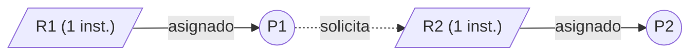

En un grafo aparecen las siguientes relaciones ¿Qué situación representa? ¿Hay algún proceso esperando recursos que no puede utilizar?

> Flecha llena: recurso asignado. Punteada: solicitud pendiente.
