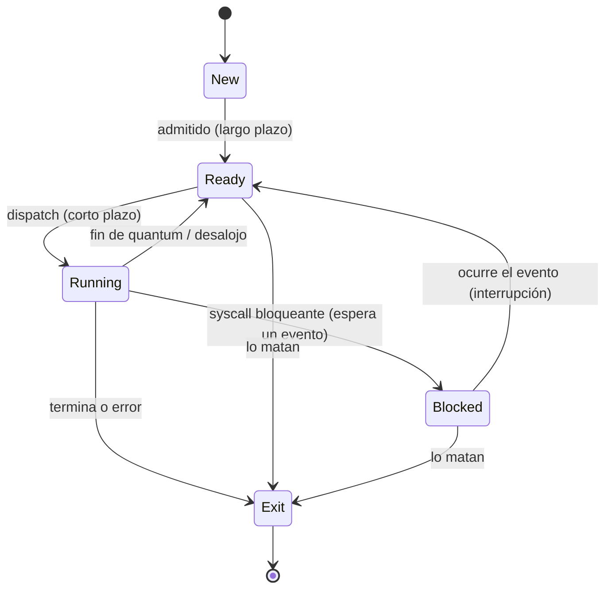

El proceso es la unidad de trabajo con la que el sistema operativo organiza la ejecución. En este tema se ve cómo se representa un proceso en memoria (su **imagen** y el **PCB**), por qué estados pasa durante su vida y qué hace el SO para crearlo, terminarlo y alternar entre procesos.

## Conceptos previos

| Concepto                  | Definición                                                                                                            |
| ------------------------- | --------------------------------------------------------------------------------------------------------------------- |
| **Programa**              | Instrucciones compiladas guardadas en disco. Es algo **estático**.                                                    |
| **Proceso**               | Un programa en ejecución que tiene memoria y recursos asignados. Es algo **dinámico**: una instancia de un programa.  |
| **Ejecución concurrente** | Dos o más programas avanzan en el mismo **intervalo** de tiempo, aunque en cada **instante** la CPU ejecuta solo uno. |
| **Monoprogramación**      | Solo un programa a la vez.                                                                                            |
| **Multiprogramación**     | Varios programas cargados que se turnan la CPU. Reduce tiempos ociosos y permite varios usuarios.                     |
| **Multiprocesamiento**    | Varios programas ejecutando **en el mismo instante**. Requiere más de un procesador.                                  |

## El proceso

Un proceso está formado por:

- El código a ejecutar.
- Sus datos.
- Su **estado** actual.
- Atributos que lo identifican.
- Los recursos que se le asignaron: memoria, archivos abiertos, semáforos, sockets, etc.

Todo eso tiene que estar representado en memoria principal. El **entorno** del proceso son las variables que recibe cuando arranca.

### Imagen del proceso

| Sección            | Qué guarda                                                                                   | Observaciones                                                           |
| ------------------ | -------------------------------------------------------------------------------------------- | ----------------------------------------------------------------------- |
| **Código (texto)** | Las instrucciones de máquina del programa.                                                   | Solo lectura para el proceso.                                           |
| **Datos**          | Variables globales y estáticas.                                                              | Existen durante toda la vida del proceso.                               |
| **Heap**           | Memoria dinámica pedida en tiempo de ejecución (`malloc`).                                   | La libera el programador (`free`). Si no la libera hay **memory leak**. |
| **Stack (pila)**   | Variables locales, parámetros, direcciones de retorno y valores de retorno de las funciones. | Crece y se achica sola con cada llamada; no hay que liberarla a mano.   |
| **PCB**            | Toda la información administrativa del proceso (ver abajo).                                  | Lo crea y lo maneja el SO; el proceso no lo puede tocar.                |

**¿Por qué hay memory leak si no hago `free()`?** El puntero se guarda en el stack, pero el bloque al que apunta está en el heap. Cuando termina la función, esa parte del stack se descarta y se pierde la dirección. El bloque del heap sigue ocupado y ya nadie puede liberarlo.

**Duración de los datos en C:**

- **Estática**: variables globales o marcadas `static`. Viven lo mismo que el proceso.
- **Automática**: variables locales. Viven mientras se ejecuta el bloque donde se declararon.
- **Asignada**: memoria del heap. Vive desde el `malloc` hasta el `free`.

### PCB (Process Control Block)

Hay **un PCB por proceso**. Está siempre en memoria y el SO lo usa para administrar el proceso y guardar su contexto cuando deja la CPU. Contiene:

- **Identificación**: PID (del proceso), PPID (del padre), UID (del usuario que lo lanzó).
- **Estado** del proceso.
- **Contexto de ejecución**: PC, PSW y los demás registros de la CPU.
- **Información de planificación**: prioridad, tiempos, etc.
- **Información de memoria**: tablas y límites.
- **Información de E/S**: archivos abiertos, dispositivos asignados.
- **Información contable**: tiempo de CPU consumido, entre otros datos.

## Estados de un proceso

### Modelo de 5 estados



| Estado      | Significado                                                                                                                                 |
| ----------- | ------------------------------------------------------------------------------------------------------------------------------------------- |
| **New**     | Se están armando sus estructuras y su PCB; espera que lo admitan.                                                                           |
| **Ready**   | Tiene todo listo y solo le falta la CPU. Está en la cola de listos.                                                                         |
| **Running** | Está usando la CPU.                                                                                                                         |
| **Blocked** | Espera un evento, como que termine una E/S o un `wait` sobre un semáforo.                                                                   |
| **Exit**    | Terminó. Se liberan sus recursos, pero se conserva el PCB (con el valor de retorno) para que el padre o la contabilidad puedan consultarlo. |

Reglas que se preguntan seguido:

- **Blocked → Running no existe.** Un proceso desbloqueado primero pasa a Ready y después espera que lo elijan.
- **Ready → Blocked no existe.** Para bloquearse, un proceso tiene que estar ejecutando y hacer una syscall bloqueante.
- **Running → Ready** ocurre por fin de quantum (interrupción de clock) o porque llegó a Ready alguien con más prioridad, en algoritmos con desalojo.
- **Blocked → Ready** ocurre cuando se produce el evento esperado. El aviso llega mediante una **interrupción**.
- A **Exit** se puede llegar desde cualquier estado: por terminar normalmente, por un error o porque otro proceso (o el SO) lo mata.

El modelo de **2 estados** (Running / Not running) y el de **3** (Running, Ready, Blocked) son simplificaciones del modelo de 5.

### Modelo de 7 estados (suspendidos)

Agrega dos estados cuyas estructuras están en **disco** en lugar de RAM. Solo el PCB queda en memoria.

- **Ready/Suspended**: estaría listo para ejecutar, pero primero hay que traerlo a memoria.
- **Blocked/Suspended**: está bloqueado y además fue sacado de memoria.

Los procesos entran y salen de estos estados por decisión del planificador de mediano plazo (swapping). Si un proceso Blocked/Suspended recibe su evento, pasa a Ready/Suspended: sigue en disco, pero ya no espera nada.

### Syscalls bloqueantes y no bloqueantes

|                                                 | Bloqueante                                | No bloqueante                                           |
| ----------------------------------------------- | ----------------------------------------- | ------------------------------------------------------- |
| Si la operación se puede resolver en el momento | La hace.                                  | La hace.                                                |
| Si va a tardar                                  | **Bloquea** al proceso hasta que termine. | No la hace en ese momento; el proceso sigue ejecutando. |
| Valores de retorno                              | OK / Error                                | OK / Error / "Reintentar"                               |

### Estados en Linux

| Letra | Estado                                                                                               |
| ----- | ---------------------------------------------------------------------------------------------------- |
| **R** | Running o runnable (Linux junta Ready y Running).                                                    |
| **S** | Sleep interrumpible (bloqueado).                                                                     |
| **D** | Sleep no interrumpible.                                                                              |
| **T** | Detenido (stopped).                                                                                  |
| **Z** | Zombie: terminó, pero el padre todavía no leyó su valor de retorno, así que el PCB sigue en memoria. |
| **X** | Muerto.                                                                                              |
| **+** | Está en primer plano (foreground).                                                                   |

## Creación de procesos

Un proceso puede crearlo el SO, para brindar un servicio, u **otro proceso**. En ese caso el creador es el padre y el nuevo es el hijo. Padre e hijo pueden ejecutar de forma concurrente, o el padre puede esperar a que el hijo termine.

**Pasos del SO para crear un proceso:**

1. Asignarle un **PID** único.
2. Reservar espacio para sus estructuras: código, datos, stack y heap.
3. Inicializar el **PCB**.
4. Poner el PCB en las colas de planificación.

El proceso queda además registrado en la **tabla de procesos**. De la cantidad de procesos activos en esa tabla surge el grado de multiprogramación.

### `fork()` en Linux

`fork()` crea un **duplicado** del proceso que la llama. El hijo recibe un PID nuevo, y su PPID es el PID del padre. Se copian registros, datos, stack, heap y hasta el PC, así que **los dos siguen ejecutando desde la instrucción siguiente al `fork()`**. Para distinguirlos se mira el valor de retorno:

```c
pid_t pid = fork();
if (pid < 0)       { /* error */ }
else if (pid == 0) { /* código del hijo */ }
else               { /* código del padre: pid es el PID del hijo */ }
```

Si el hijo necesita correr **otro** programa, reemplaza su imagen con alguna función de la familia `exec` (por ejemplo `execv`).

## Finalización de procesos

- **El propio proceso** termina, en forma normal (`exit()`) o anormal (un error).
- **El SO u otro proceso** lo termina (`kill`). Un padre puede terminar a un hijo si usa más recursos de los permitidos, si su tarea ya no hace falta o si el propio padre está terminando.
- El padre recoge el resultado del hijo con `wait()`. Mientras no lo hace, el hijo queda **zombie**.
- Si el padre muere antes, el hijo **sigue ejecutando**. En Linux lo "adopta" otro proceso (históricamente `init`).

## Cambio de proceso (process switch)

Ocurre cuando el proceso que usa la CPU deja de ejecutar y el SO pone a otro. Implica:

1. Guardar el contexto del proceso saliente en su PCB.
2. Actualizar su estado y moverlo a la cola que corresponda.
3. Elegir el próximo proceso (planificador de corto plazo).
4. Cargar el contexto del entrante desde su PCB.

Todo ese trabajo es **overhead**: tiempo de CPU que no avanza ningún proceso de usuario. Por eso conviene minimizarlo.

No hay que confundirlo con el **cambio de contexto** en sí, que es más general. También hay cambio de contexto cuando se atiende una interrupción o una syscall, y en esos casos no necesariamente cambia el proceso.

## Preguntas de parcial

**1. ¿Quiénes pueden crear o finalizar procesos? ¿Cómo? ¿Qué le pasa al hijo si el padre termina de forma inesperada?**

> Los crea el SO u otro proceso, siempre mediante una syscall (por ejemplo `fork`). El SO asigna el PID, reserva las estructuras, arma el PCB y lo pone en las colas de planificación. Los termina el propio proceso (`exit`), el SO u otro proceso (`kill`). Si el padre muere, el hijo sigue ejecutando normalmente: son procesos independientes.

**2. ¿Qué comparten un proceso padre y su hijo? ¿Y dos hilos del mismo proceso?**

> Padre e hijo no comparten memoria: el hijo arranca con una **copia** de la imagen del padre y cada uno tiene la suya. Lo único que los vincula es que el hijo conoce el PID de su padre (PPID). En cambio, dos hilos del mismo proceso comparten código, datos, heap, archivos abiertos y el PCB del proceso. Cada hilo tiene su propio stack y su propio TCB.

**3. Dé ejemplos de las transiciones Running → Ready, Suspended/Ready → Ready, Ready → Exit y Ready → Blocked.**

> - Running → Ready: se le terminó el quantum, o llegó a Ready un proceso con más prioridad en un algoritmo con desalojo.
> - Suspended/Ready → Ready: el planificador de mediano plazo lo trae de vuelta a memoria (swap in) porque bajó la carga.
> - Ready → Exit: otro proceso o el SO lo mata mientras espera la CPU.
> - Ready → Blocked: **no es posible**. Para bloquearse, el proceso tiene que estar ejecutando y pedir algo que lo haga esperar.

**4. ¿Por qué no existe la transición Blocked → Running?**

> Porque cuando termina el evento esperado, el proceso solo queda en condiciones de ejecutar. Pasa a Ready, y es el planificador de corto plazo el que decide cuándo le toca la CPU.

_Fuente: Resumen SO (págs. 15–23)._
